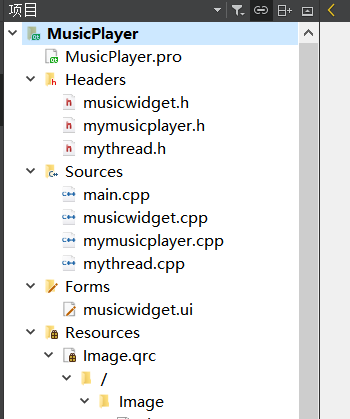
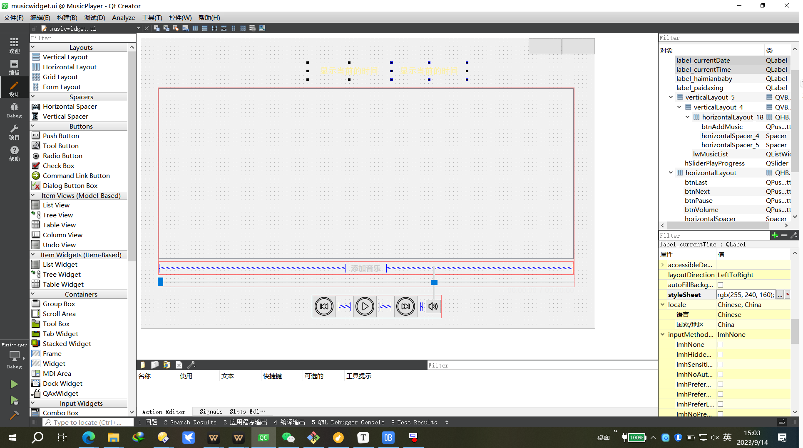

# :white_check_mark:基于Qt的简易音乐播放器 :books:

**---->>:heavy_check_mark:已美化:wave:**	---------	:+1::point_up_2::star:

### :green_book:1.项目简介

**:sunflower:MusicPlayer**是基于Qt开发，并且未使用除了 C++标准库 和 Qt 之外的第三方库，保证了库的可移植性以及库的纯粹性。

:musical_note: 音乐模块中通过QHash数据结构存储音乐列表。实现播放暂停、上下曲切换、音量控制、进度条控制、添加音乐、存储音乐列表和通过子线程Thread实时更新当前音乐播放进度的时间显示。

**用到的Qt库有**：

- core 
- gui 
- multimedia

:grinning:理论上可以部署到任何Qt支持的平台上。:ear_of_rice:

\```

🕙 分享是一种美德，如果帮到你了，还请右上随手点个 🌟 Star，谢谢:wink:

\```

### :musical_note:简易音乐播放器

1. 在无添加时随意点击不会出现程序崩溃

2. 可添加\*.mp3、\*.wav 、\*.wma三种音频格式

> ​	有能力的可以继续修改添加QVideoWidget模块播放视频

3. 进度条时间显示的计算我将其放在子线程中实现

**运行示例：**


---

### :bookmark_tabs:开发流程文档

需求：编写一款桌面端音乐播放器。

> 开发环境：
>
> 平台：QT 5.14.2
>
> 构建套件：Desktop_Qt_5_14_2_MinGW_32_bit
>
> 系统：Windows10，理论上可以部署到任何Qt支持的平台上。
>
> 推荐使用Linux系统或者Unix系统

目录结构：



> 学习参考过程中应对照工程文件来进行

开发过程

### :house_with_garden:1.界面设计



#### 1.1 设计样式

:fallen_leaf:添加了一些动画效果和透明效果、让界面感觉更"高大尚":joy:

```c++
void MusicWidget::UI_Design() {
    this->setWindowTitle("xtc天气");
    this->setWindowFlags(Qt::FramelessWindowHint | Qt::WindowSystemMenuHint | Qt::WindowMinimizeButtonHint);  //窗口为无边框，同时保留系统菜单和最小化按钮

    ui->btnPause->setIcon(QIcon(":/Image/pause.png"));
    ui->btnPause->setStyleSheet( "QPushButton{background:rgba(255,255,255,0.2);border-radius:25px;padding:5px 5px}");
    ui->btnVolume->setStyleSheet( "QPushButton{background:rgba(255,255,255,0.2);border-radius:25px;padding:5px 5px}");
    ui->btnLast->setStyleSheet( "QPushButton{background:rgba(255,255,255,0.2);border-radius:25px;padding:5px 5px}");
    ui->btnNext->setStyleSheet("QPushButton{background:rgba(255,255,255,0.2);border-radius:25px;padding:5px 5px}");
    ui->btnAddMusic->setStyleSheet("QPushButton::hover{font:19px;}" "QPushButton{background:rgba(255,255,225,0.2);color:#FFDEAD;border-radius:16px;padding:5px 5px}");

    ui->pushButtonMini->setIcon(QIcon(":/Image/Min.png"));   //最小化按钮
    ui->pushButtonMini->setStyleSheet("QPushButton{border:none;color:rgb(122, 197, 205);}" "QPushButton:hover{background-color: #1E90FF;border:none;color:rgb(255, 255, 255);}");
    ui->pushButtonDestroy->setIcon(QIcon(":/Image/Close.png")); //关闭按钮
    ui->pushButtonDestroy->setStyleSheet("QPushButton{border:none;color:rgb(122, 197, 205);}" "QPushButton:hover{background-color: #FF0000;border:none;color:rgb(255, 255, 255);}");

    ui->vSliderVolume->setVisible(false);
    ui->lwMusicList->setHorizontalScrollBarPolicy(Qt::ScrollBarAlwaysOff);//关闭水平滚动条
    movieToLoad(); //加载gif
}
/**
 * @brief MusicWidget::movieToLoad
 * 显示一些gif动画效果
 */
void MusicWidget::movieToLoad() {
    movie = new QMovie(":/Image/timg07.gif");   //设置GIF格式背景图
    ui->label_background->setMovie(movie);
    movie->start();
    movie3 = new QMovie(":/Image/haimianbaby.gif");
    movie3->setScaledSize(QSize(55, 60)); // 设置GIF动画的尺寸与QLabel的尺寸相同
    ui->label_haimianbaby->setMovie(movie3);
    movie3->start();
    movie4 = new QMovie(":/Image/paidaxing.gif");
    movie4->setScaledSize(QSize(55, 60)); // 设置GIF动画的尺寸与QLabel的尺寸相同
    ui->label_paidaxing->setMovie(movie4);
    movie4->start();
}
```

#### 1.2 获取当前时间

添加一个定时器、每1000ms更新一次时间

```c++
    timer = new QTimer(this);  //定时器显示获取当前时间
    connect(timer, &QTimer::timeout, this, &MusicWidget::updateCurrent);
    timer->start(500);
```

时间显示

```c++
void MusicWidget::updateCurrent() {
    QDateTime currentTime = QDateTime::currentDateTime();
    QString nowDate = currentTime.toString("yyyy-MM-dd dddd");
    QString nowTime = currentTime.toString("hh:mm:ss");
    ui->label_currentTime->setText(nowTime);
    ui->label_currentDate->setText(nowDate);
}
```

#### 1.3 窗口无边框、鼠标按住widget拖动

> 类似联想电脑管家窗口

设置窗口无边框、保留最小化按钮

```c++
this->setWindowFlags(Qt::FramelessWindowHint | Qt::WindowSystemMenuHint | Qt::WindowMinimizeButtonHint); 
```

##### 1.3.1鼠标拖动

鼠标按住Widget主窗口的任意位置，可以拖动窗口

声明：

```c++
private:
    QPoint startPos;//鼠标点击时的全局位置
    QPoint startPos1;//鼠标点击时的相对位置
    void mousePressEvent(QMouseEvent *event);//鼠标点击
    void mouseMoveEvent(QMouseEvent *event);//鼠标追踪
```

当鼠标按下时获取整个屏幕的全局坐标和相对于Widget的坐标

```c++
//记录拖动起始位置
void MusicWidget::mousePressEvent(QMouseEvent *event) {
    startPos = event->globalPos();//获取点击鼠标时的全局坐标
    startPos1 = event->pos();//获取点击鼠标的相对MusicWidget窗口的坐标
}
```

鼠标移动，如果左键按下，

​	计算鼠标现在全局窗口相对于移动前的全局窗口位置，如果鼠标移动manhattanLength像素距离大于4才执行移动。

​	现在的全局位置 减去 移动初的相对于widget的相对位置则为现在的窗口移动后的位置。this->move(event->globalPos() - startPos1);

```c++
//窗口移动
void MusicWidget::mouseMoveEvent(QMouseEvent *event) {
    if (event->buttons() & Qt::LeftButton) { //判断是否是左键按下
        QPoint movePos = event->globalPos() - startPos;//计算鼠标移动位置
        if ( movePos.manhattanLength() > 4) //判断移动像素距离，防抖动
            this->move(event->globalPos() - startPos1);
        return;
    }
}
```


##### 1.3.2最小化和关闭按钮

```c++
/**
 * @brief MusicWidget::on_pushButtonMini_clicked
 *  窗口最小化按钮
 */
void MusicWidget::on_pushButtonMini_clicked() {
    showMinimized();
    //showMaximized();//最大化
}
/**
 * @brief MusicWidget::on_pushButtonDestroy_clicked
 * 窗口关闭按钮
 */
void MusicWidget::on_pushButtonDestroy_clicked() {
    this->close();
}
```

#### 1.4 设计图标软件显示图标

需要在.pro中添加上需要设置的图标名称

```c++
RC_ICONS = logo.ico
```

图标的后缀格式必须为.ico

将图片添加到项目的和工程文件.pro同级的目录下。


### :palm_tree:4.简易音乐播放器MyMusicPlayer

需要在.pro添加multimedia多媒体模块				发音：/ˌmʌltiˈmiːdiə/

```c++
QT       += multimedia
```

mymusicplayer.h中必须添加如下头文件：

```c++
#include <QObject>
#include <QMediaPlayer>
#include <QString>
```

添加5个方法

```c++
    void playMusic(QString mediaPath); //播放
    void pauseMusic();  //暂停
    void setMusicPosition(int sliderPlayValue); //设置音乐播放当前位置
    void setMusicVolume(int volume);    //设置音量
    bool isToplay(); //判断现在是否在播放
```

设置槽函数和信号

```c++
public slots:
    void setSliderPlayProgress();//水平滑块播放进度

signals:
 void calculateFinished(const int &number);
 void playPosition(const int &musicPositon);
 void playDuration(const int &musicDuration);
```

设置成员

```c++
 QMediaPlayer *myPlayer;
 QString playpath; //路径判断，如果不相等则更换路径，否则继续播放
```

new一个播放器类的对象myPlayer

```c++
myPlayer = new QMediaPlayer(this);
```

#### 4.1播放playMusic

用于播放指定路径的音乐。

如果播放器当前没有播放音乐，或者提供的路径与当前播放的音乐路径不同，就设置新的音乐路径并播放音乐。否则继续播放

```c++
void MyMusicPlayer::playMusic(QString mediaPath){
    if(QMediaPlayer:: PlayingState != myPlayer->state() && mediaPath != playpath ){
        playpath = mediaPath;
        qDebug()<<"playMusic: myPlayer->state:"<<myPlayer->state();
        myPlayer->setMedia(QUrl::fromLocalFile(playpath));
    }
    myPlayer->play();
}
```

#### 4.2暂停音乐

如果在播放则暂停

```c++
void MyMusicPlayer::pauseMusic(){
    if(QMediaPlayer:: PlayingState == myPlayer->state()){
        qDebug()<<"pauseMusic: myPlayer->state:"<<myPlayer->state();//qDebug用于判断当前状态
        myPlayer->pause();
    }
}
```

#### 4.3传递进度条数值、当前播放时间、总时间

```c++
/**
 * @brief MyMusicPlayer::setSliderPlayProgress
 * 1.音乐在走的时候，进度条也跟随变换 把音乐当前的百分比值传递给进度条
 * 2.传递信号 音乐当前播放的时间位置 musicPosition 让子线程计算处理
 * 3.传递音乐的总时间信号 让子进程处理musicPosition
 */
void MyMusicPlayer::setSliderPlayProgress(){
    int sliderNumber = myPlayer->position()*100/myPlayer->duration();
    emit calculateFinished(sliderNumber);
    int musicPosition=myPlayer->position()/1000;
    emit playPosition(musicPosition);
    int musicDuration =myPlayer->duration()/1000;
    emit playDuration(musicPosition); //返回音乐总帧数 总时间
}
```

#### 4.4 拖动滑块改变音乐播放位置

```c++
/**
 * @brief MyMusicPlayer::setMusicPosition
 * @param position
 * 拖动进度条，改变滑块的值，传递给音乐，改变音乐的播放位置，然后播放
 */
void MyMusicPlayer::setMusicPosition(int sliderPlayValue){
    myPlayer->setPosition(myPlayer->duration()*sliderPlayValue/100); //总帧数 时长
    myPlayer->play();
}
```

#### 4.5 设置播放器音量

```c++
void MyMusicPlayer::setMusicVolume(int volume)
{
    myPlayer->setVolume(volume);
}
```

#### 4.6 判断当前播放器的状态

```c++
/*判断当前是否播放 	如果为true	则说明正在播放 反之亦然*/
bool MyMusicPlayer::isToplay(){
    return (QMediaPlayer:: PlayingState == myPlayer->state());
}
```

### :raised_hand_with_fingers_splayed:5.接收处理好的音乐数据

成员声明：

```c++
    MyMusicPlayer *myMediaPlayer;   
    QTimer *timer2; //读取播放器进度条的值
    int sliderPlayValue; //记录读取进度条的值
    QString mediaPath;//存储当前音乐文件的目录加文件名
    QHash<QString,int> musicFileIndex; //添加一个成员变量来保存音乐文件路径和索引的映射
    int valueindex; //用于判断当前上一曲或下一曲的索引value值
    int countFiles=0;//hash key的键值value 计算添加的文件个数
    int playtime; //显示当前歌曲进度时间
```

**new**一个MyMusicPlayer类的对象

```c++
 myMediaPlayer = new MyMusicPlayer;
```

再new一个定时器，

```c++
timer2 = new QTimer(this);  //定时器0.3s获取一次播放进度条 刷新进度条
connect(timer2, &QTimer::timeout, myMediaPlayer, &MyMusicPlayer::setSliderPlayProgress);
```

当点击播放音乐启动定时器，定时器结束后转到设置进度条数值的槽函数，

#### 5.1 水平滑块位置跟随音乐变化

计算滑块相对于音乐当前播放时间的位置，

```c++
int sliderNumber = myPlayer->position()*100/myPlayer->duration();
    emit calculateFinished(sliderNumber);
```

接收到信号sliderNumber后，设置水平进度条的值

```c++
connect(myMediaPlayer,&MyMusicPlayer::calculateFinished,this,&MusicWidget::sethSliderValue);
```

```c++
/* 设置进度条 当歌曲播放时，返回当前播放进度 */
void MusicWidget::sethSliderValue(const int &number) {
    ui->hSliderPlayProgress->setValue(number);
}
```

#### 5.2 添加音乐文件

这里选用QHash存储音乐播放列表

```c++
    QHash<QString,int> musicFileIndex; //添加一个成员变量来保存音乐文件路径和索引的映射
```

详细看注释

```c++
void MusicWidget::on_btnAddMusic_clicked() {
    QFileDialog fileDialog(this);//创建文件对话框
    fileDialog.setFileMode(QFileDialog::AnyFile);	//设置文件对话框的文件模式为任意文件
    fileDialog.setNameFilter("Music Files (*.mp3 *.wav *.wma)"); //设置文件对话框的过滤器，只显示符合指定模式的文件
    if (fileDialog.exec()) { //执行文件对话框，如果用户选择了一些文件，那么执行括号内的代码 获取要添加的列表 
        //if语句中这里可以添加一个for循环实现选择多个文件；我只设置了选择一个文件
        QStringList fileNames = fileDialog.selectedFiles(); //获取选择的文件列表
        QString fileName = fileNames[0];
        ui->lwMusicList->addItem(fileName); //将每个文件添加到QListWidget控件
        musicFileIndex[fileName] =countFiles+1; //文件名作为key 文件号作为value值从1开始 将索引和文件路径添加到映射中
        qDebug()<<"value:"<<musicFileIndex.value(fileName)<<"key:"<<musicFileIndex.key(countFiles+1);
    }
    countFiles = ui->lwMusicList->count(); //计算添加的音乐文件数目
    qDebug()<<"总添加音乐count:"<<countFiles;
}
```

#### 5.3 播放和暂停

如果当前的播放列表为空则不做响应，

如果正在播放，点击后设置图标icon为暂停按钮并关闭定时器和音乐；否则如果没有播放，打开音乐和定时器同时设置图标为播放态。

```c++
/**
 * @brief MusicWidget::on_btnPause_clicked
 * 播放和暂停
 */
void MusicWidget::on_btnPause_clicked() {
    if (this->mediaPath.isNull()) {
        return;
    } else {
        if (myMediaPlayer->isToplay()) { //为真 true 正在播放,将其关闭
            ui->btnPause->setIcon(QIcon(":/Image/pause.png"));
            myMediaPlayer->pauseMusic();
            timer2->stop();
        } else { //false 没有播放，点击后播放
            ui->btnPause->setIcon(QIcon(":/Image/stop.png"));
            myMediaPlayer->playMusic(this->mediaPath);
            timer2->start(500);
        }
    }
}
```

#### 5.4 拖动滑块改变音乐播放位置

```c++
/**
 * @brief MusicWidget::on_hSliderPlayProgress_valueChanged
 * @param value
 * 当滑动滑块时关闭播放，并且关闭进度条刷新定时器
 * 目前设置的只有滑动有效，直接点击跳转位置无效
 */
void MusicWidget::on_hSliderPlayProgress_valueChanged(int value) {
    if (ui->hSliderPlayProgress->isSliderDown()) { //isSliderDown判断滑块是否被按下
        ui->btnPause->setIcon(QIcon(":/Image/pause.png"));
        myMediaPlayer->pauseMusic(); //关闭播放
        if(timer2->isActive()){
            timer2->stop();//关闭定时器
        }
        // 记录滑块的值
        this->sliderPlayValue = value;
    }
}
```

```c++
/**
 * @brief MusicWidget::on_hSliderPlayProgress_sliderReleased
 * 当释放滑块后读取现在的进度条值 传递给音乐播放器 音乐播放器setMusicPosition中设置好位置后直接播放
 */
void MusicWidget::on_hSliderPlayProgress_sliderReleased() {
    if(mediaPath.isNull()){
        return;
    }
    myMediaPlayer->setMusicPosition(this->sliderPlayValue); //滑块的值传递改变音乐位置
    ui->btnPause->setIcon(QIcon(":/Image/stop.png")); //开始播放在setMusicPosition中完成
    timer2->start(500);
}
```

#### 5.5 设置音量

##### 5.5.1 隐藏音量条、点击音量图标显示

```c++
/**
 * @brief MusicWidget::on_btnVolume_clicked
 * 点击按钮设置音量条显示 UI设计中初始时音量条隐藏
 */
void MusicWidget::on_btnVolume_clicked() {
    if (ui->vSliderVolume->isVisible()) {
        ui->vSliderVolume->setVisible(false);
    } else {
        ui->vSliderVolume->setVisible(true);
    }
}
```

```c++
/**
 * @brief MusicWidget::on_vSliderVolume_sliderReleased
 * 音量条设置好后隐藏
 */
void MusicWidget::on_vSliderVolume_sliderReleased() {
    ui->vSliderVolume->setVisible(false);
}
```

##### 5.5.2 将音量值返回给播放器

```c++
void MusicWidget::on_vSliderVolume_valueChanged(int value) {
    myMediaPlayer->setMusicVolume(value);
}
```


#### 5.6 双击播放/单击选中

##### 双击

```c++
/* 双击wMusicList清单播放 */
void MusicWidget::on_lwMusicList_itemDoubleClicked(QListWidgetItem *item) {
    timer2->stop();
    this->mediaPath = item->text();
    qDebug() << "双击成功" << mediaPath << endl;
    myMediaPlayer->pauseMusic();
    ui->btnPause->setIcon(QIcon(":/Image/stop.png"));
    myMediaPlayer->playMusic(this->mediaPath);
    timer2->start(500);
}
```

##### 单击

```c++
void MusicWidget::on_lwMusicList_itemClicked(QListWidgetItem *item)
{
        this->mediaPath = item->text();
}
```


#### 5.7 上下曲切换

##### 5.7.1 上一曲

如果音乐路径是空，则无效。

ListWidget列表是从0开始，我们的musicFileIndex的value值是从1开始的所以要减去1

```c++
void MusicWidget::on_btnLast_clicked() {
    if (this->mediaPath.isNull()) {
        return;
    }
    QListWidgetItem *item = ui->lwMusicList->item(musicFileIndex.value(mediaPath)-1);
    item->setSelected(false);        //设置是否选中 选中则有高亮 切换歌曲的时候当前这个高亮关闭
    valueindex = musicFileIndex.value(mediaPath)-1; //通过哈希表的键找到对应的索引值 索引值必须大于等于0
    if (valueindex >= 1) {
        setPreOrNextPlay();
    } else {     //设置播放列表循环
        valueindex = countFiles;
        setPreOrNextPlay();
    }
}
```

##### 5.7.2 下一曲

同理如上，ListWidget列表是从0开始，我们的musicFileIndex的value值是从1开始的所以要减去1

```c++
void MusicWidget::on_btnNext_clicked() {
    if (this->mediaPath.isNull()) {
        return;
    }
    QListWidgetItem *item = ui->lwMusicList->item(musicFileIndex.value(mediaPath)-1);
    item->setSelected(false);        //设置是否选中 选中则有高亮 切换歌曲的时候当前这个高亮关闭
    valueindex = musicFileIndex.value(mediaPath)+1; //通过哈希表的键找到对应的索引值 索引值必须大于等于0
    if (valueindex <= countFiles) {
        qDebug()<<"valueindex:"<<valueindex;
        setPreOrNextPlay();
    } else {     //设置播放列表循环
        valueindex = 1;
        setPreOrNextPlay();
    }
}
```


点击上一曲或者下一曲，如果成功则播放

```c++
void MusicWidget::setPreOrNextPlay() {
    mediaPath = musicFileIndex.key(valueindex); //通过对应的索引值找到相应的键值
    qDebug() << "value:" << valueindex << "key:" << mediaPath;
    QListWidgetItem *item = ui->lwMusicList->item(musicFileIndex.value(mediaPath)-1);
    item->setSelected(true);        //设置是否选中 选中则有高亮

    timer2->stop();
    myMediaPlayer->pauseMusic();
    //先关闭，然后播放
    ui->btnPause->setIcon(QIcon(":/Image/stop.png"));
    myMediaPlayer->playMusic(this->mediaPath);
    timer2->start(500);
}
```


#### 5.8 显示音乐当前播放时间/总时间

> 这里涉及到线程类，通过子线程计算当前的时间和总时间，通过信号传递回来调用槽函数然后显示，再在第六节讲解

```c++
/**
 * @brief MusicWidget::setMusicTime
 * @param musicTime
 * 显示音乐播放进行时 当前时间
 */
void MusicWidget::showMusicPosition(QString time){
    ui->lblPlayTime->setText(time);
}
/**
 * @brief MusicWidget::setMusicDuration
 * @param musicTime
 * 显示音乐总时间
 */
void MusicWidget::showMusicDuration(QString time){
    ui->lblMusicTime->setText(time);
}
```


### :seedling:6.子线程

新建一个MyThread类

添加信号和槽函数

```c++
signals:
    void completePosition(const QString &time);
    void completeDuration(const QString &time);
```

在Qt中，信号和槽之间的参数传递是通过复制进行的。由于信号和槽机制中的参数传递是通过复制进行的，所以参数类型必须是const的，以防止在传递过程中被修改。

如果参数不是const的，那么当信号被发出时，参数的值会被复制并传递给槽。如果在这个过程中修改了参数的值，那么原始参数的值也会被修改，然后可能报错。

另外，参数类型通常是引用类型，因为这样可以避免复制大型对象，从而提高性能。如果参数类型是值类型，那么在传递过程中会复制该值。如果该值是一个大型对象，那么复制可能会花费相当多的时间和资源。通过使用引用类型，可以避免这种复制，从而提高程序的效率。

```c++
public slots:
    void handlePlayPosition(const int &musicTime);
    void handlePlayDuration(const int &musicTime);
```

通常建议将信号和槽的参数声明为const引用类型，这样可以确保参数在传递过程中不会被修改，并且可以提高程序的性能。

```c++
private:
    QString time1;  //当前播放时间
    int time;       //得到传送过来的总时间秒数，如果和上一次不相等则更新、否则不操作
```


通过播放器传递的信号转到相应的槽函数处理

```c++
/**
 * @brief MyThread::handlePlayPosition
 * @param musicTime
 * 计算当前播放位置的时间并返回字符串
 */
void MyThread::handlePlayPosition(const int &musicTime){
    int h,m,s;
    h = musicTime/3600;
    m = (musicTime-h*3600)/60;
    s = musicTime-h*3600-m*60;
    time1 = QString("%1:%2:%3").arg(h).arg(m).arg(s);
    emit completePosition(time1);
}
```

每一次播放音乐文件的总时间只需要接收一次即可，如果下一次传过来的数据没有变化则不操作。

```c++
/**
 * @brief MyThread::handlePlayDuration
 * @param musicTime
 * 计算总时间然后返回 
 */
void MyThread::handlePlayDuration(const int &musicTime){
    if(musicTime != time){
        time = musicTime;
        int h,m,s;
        h = musicTime/3600;
        m = (musicTime-h*3600)/60;
        s = musicTime-h*3600-m*60;
        QString time2 = QString("%1:%2:%3").arg(h).arg(m).arg(s);   //计算总时间
        qDebug() << "子线程号_handlePlayDuration：" << QThread::currentThread();
        emit completeDuration(time2);
    }
}
```

处理完后都添加参数发射信号出去


### :point_up_2:7.主线程中创建子线程

声明

```c++
    MyThread *myT;
    QThread *thread;
```

创建对象myT对象，不能指定父对象因为要将其添加到线程，否则报错；然后通过moveToThread加入到子线程。

```c++
	myT = new MyThread; //动态分配空间，不能指定父对象
	thread = new QThread(this);//创建子线程
	myT->moveToThread(thread);//把自定义线程加入到子线程中
```

通过MyMusicPlayer类发来的信号转到子线程处理。子线程处理好后通过信号发送回主线程调用槽函数显示当前时间。

:carrot:**注意：**必须通过connect信号槽函数连接，如果直接调用函数，那么处理仍然是在主线程。

```c++
	connect(myMediaPlayer, &MyMusicPlayer::playPosition, myT, &MyThread::handlePlayPosition);
	connect(myMediaPlayer, &MyMusicPlayer::playDuration, myT, &MyThread::handlePlayDuration);
	connect(myT, &MyThread::completePosition, this, &MusicWidget::showMusicPosition);
	connect(myT, &MyThread::completeDuration, this, &MusicWidget::showMusicDuration);
	qDebug() << "主线程号：" << QThread::currentThread();
	thread->start();
```

### :arrows_counterclockwise:8.测试

对天气预报和音乐播放器分别进行测试，即使在未添加数据、音乐文件的情况下、点击任何按钮和操作，不会出现之前的程序崩溃异常，直接强制退出。二次优化后提高了程序的稳定性。

**测试结果：**正常运行。

天气预报和英语播放器同步进行测试，在查询天气的同时播放音乐，进行播放器操作、未见异常。

测试结果：正常运行。

### :mountain_railway:9.部署

理论上可将Qt部署到任何平台上


##  :tent:总结

在做音乐播放器的时候，要考虑到：

1.如果不播放不添加，按钮是否生效，程序是否会崩溃。怎么判断是否生效，比如说如果我不添加音乐播放，直接点下一曲 程序会怎样。

2.上一曲下一曲如何判断当前在哪一个list清单中的位置。

3.播放和暂停实际是在musicPlayer类中进行的，当我点击播放按钮时如何判断当前是播放还是暂停同时将播放的icon反转呢？

3.拖动进度条改变音乐位置和音乐在播放时进度条跟随变化，如果音乐正在播放，拖动滑块两个事件重叠在一起了如何解决。我选择关闭音乐和定时器，拖动完释放后再打开音乐和播放器。

4.选择何时获取音乐当前位置，如果不停的监听计算音乐的改变返回的值，这样会耗费巨大的资源。我添加了定时器每300ms计算一次。

5.在计算滑块相对于播放音乐时的位置时，还需要同步计算当前的音乐播放时间"时分秒",并且还要计算总时间，假设是4分钟，4\*60\*1000=240000,如果在主线程中上述同步时不停的计算，并且还要不停更新UI，会不会因为耗费资源量太大或者计算太耗时影响程序的运行、导致程序界面无响应。计算量过大时，主线程无法及时响应用户的输入、处理其他事件、UI界面更新请求，从而导致程序失去响应。所以在程序中将计算任务添加到单独的线程中进行。

> 将耗时的计算任务放在单独的线程中可以提高应用程序的响应性和用户体验，但需要遵循正确的线程管理和同步机制，以确保线程安全和数据一致性。


:question:**这里留一个问题？**

有一个问题，在初始运行程序的时候，子线程中构造函数执行时其子线程号和主线程时一致的。

```c++
子线程号_构造函数： QThread(0x1dce280)
主线程号： QThread(0x1dce280)
```

但当执行子线程中的槽函数时子线程号和主线程的又不一致，体现出了在子线程中的操作。

```c++
子线程号Duration： QThread(0x6a81ad8)
```

当我关闭窗口，释放线程的时候，子线程的析构函数子线程号和主线程又是一致的。

```c++
子线程号_析构函数： QThread(0x1dce280)
```

这是为什么？


:beginner: :star:

